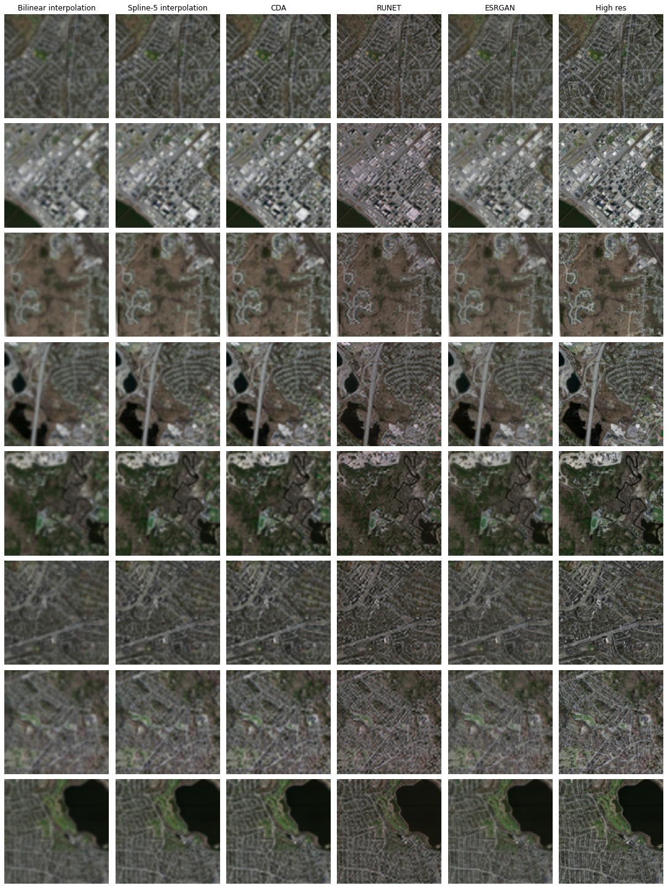

# Single-Image Super-Resolution for satellite imaging
### Deep Learning Course - MVA 2020-2021
##### Quentin Spinat & Thomas Chabal

#### Links
- [Project proposal](./Report/proposal.pdf)
- [Project final report](./Report/report.pdf)
- [Slides of the presentation](./Report/slides.pdf)
- [Video presentation of the project](https://drive.google.com/file/d/1J3Y6-vgmsUMbOmsCHzrYPKWuFnqC7Nb1/view?usp=sharing)

#### Content of the study
- [Spline interpolations](./Python/classical_cv/)
- [Coupled Deep Autoencoder](./Python/autoencoder/), reimplementing the paper [Coupled Deep Autoencoder for Single Image Super-Resolution](https://ieeexplore.ieee.org/document/7339460) from Zeng et al.
- [Robust UNet](./Python/runet/), reimplementing the paper [RUNet: A Robust UNet Architecture for Image Super-Resolution](https://openaccess.thecvf.com/content_CVPRW_2019/papers/WiCV/Hu_RUNet_A_Robust_UNet_Architecture_for_Image_Super-Resolution_CVPRW_2019_paper.pdf) from Hu et al.
- [ESRGAN](./Python/rrdn_gans/), reusing [this implementation](https://github.com/idealo/image-super-resolution) of the paper [ESRGAN: Enhanced Super-Resolution Generative Adversarial Networks](https://arxiv.org/pdf/1809.00219.pdf) from Wang et al.

#### Evaluation
The work was done using the [Massachusetts Road Dataset](https://www.cs.toronto.edu/~vmnih/data/) (also available [here](https://www.kaggle.com/insaff/massachusetts-roads-dataset)).

From left to right: Bilinear interpolation, spline interpolation of order 5, Coupled Deep Autoencoder, Robust UNet, ESRGAN and the high-resolution target.

